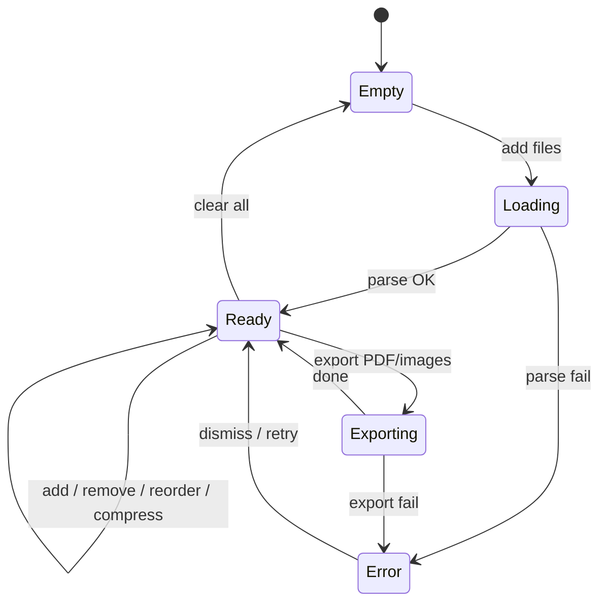

# Design: PDF Concatenator

## UI/UX

### Экран: единая рабочая область

```
┌─────────────────────────────────────────────────────────────┐
│  PDF Concatenator                    [Add files] [Clear all]  │
├─────────────────────────────────────────────────────────────┤
│  ┌ ─ ─ ─ ─ ─ ─ ─ ─ ─ ─ ─ ─ ─ ─ ─ ─ ─ ─ ─ ─ ─ ─ ─ ─ ─ ┐  │
│  │     Drop PDF, JPG or PNG here  or  click to browse   │  │
│  └ ─ ─ ─ ─ ─ ─ ─ ─ ─ ─ ─ ─ ─ ─ ─ ─ ─ ─ ─ ─ ─ ─ ─ ─ ─ ┘  │
│                                                             │
│  Pages (12)                                                 │
│  ┌────────┐ ┌────────┐ ┌────────┐ ┌────────┐               │
│  │ thumb  │ │ thumb  │ │ thumb  │ │ thumb  │  ...          │
│  │ PDF p1 │ │ PDF p2 │ │  PNG   │ │  JPG   │               │
│  │ [×]    │ │ [×]    │ │ [×]    │ │ [×]    │               │
│  └────────┘ └────────┘ └────────┘ └────────┘               │
│       ↕ drag handle / whole card draggable                    │
│                                                             │
│  [Export PDF]  [Export PNG ▾]  [Export JPG ▾]               │
│  Compress (image pages): Quality [====●===] 70%  [Apply]    │
└─────────────────────────────────────────────────────────────┘
```

### Компоненты (ориентир для Dev)

| Компонент | Назначение |
|-----------|------------|
| `App` | Layout, toolbar, drop zone |
| `PageGrid` | Сетка карточек страниц |
| `PageCard` | Thumbnail, badge типа (PDF/Image), delete, drag handle |
| `DropZone` | Drag-over highlight, file input |
| `CompressPanel` | Slider quality 10–100, apply to selected/all image pages |
| `ExportActions` | Кнопки экспорта + progress overlay |

Стили: Tailwind + shadcn `Button`; новые shadcn-компоненты (Slider, Dialog) — только при необходимости, минимально.

### Превью

- **PDF-страница:** pdf.js render page → `canvas` → `data:` / `blob:` URL для ``.
- **Image-страница:** blob URL из обработанных байтов.
- Thumbnail scale: ~150–200 px по длинной стороне (не влияет на export quality).

---

## Состояния и переходы



| Состояние | UI |
|-----------|-----|
| `empty` | Только drop zone + подсказка |
| `loading` | Spinner/skeleton на месте будущих thumbnails |
| `ready` | Сетка страниц, активные кнопки |
| `exporting` | Disabled actions + «Processing…» |
| `error` | Toast/alert с текстом ошибки |

---

## Поведение / бизнес-правила

### Модель данных (Zustand)

```typescript
type SourcePdf = {
  id: string
  fileName: string
  bytes: Uint8Array
  pageCount: number
}

type WorkspacePage =
  | {
      id: string
      kind: 'pdf-native'
      sourcePdfId: string
      pageIndex: number        // 0-based
      label: string            // e.g. "doc.pdf — p.2"
    }
  | {
      id: string
      kind: 'image'
      fileName: string
      mimeType: 'image/jpeg' | 'image/png'
      bytes: Uint8Array        // после resize/compress
      width: number
      height: number
      quality?: number         // для JPEG, 0.1–1
    }

type AppStore = {
  sources: Record<string, SourcePdf>
  pages: WorkspacePage[]
  status: 'empty' | 'loading' | 'ready' | 'exporting' | 'error'
  error: string | null
  // actions: addFiles, removePage, reorderPages, compressImagePages, exportPdf, exportImages, clear
}
```

### Импорт

1. **PDF:** `PDFDocument.load(bytes)` (pdf-lib) → для каждой страницы создать `pdf-native` entry; сохранить `SourcePdf` один раз на файл.
2. **JPG/PNG:** decode → `fitImageToA4Canvas()` → `image` entry.

### fitImageToA4Canvas (2480×3508)

```
A4_W = 2480, A4_H = 3508

if img.w <= A4_W && img.h <= A4_H:
  out = img (no upscale)
else:
  scale = min(A4_W / img.w, A4_H / img.h)
  out = resize(img, floor(img.w * scale), floor(img.h * scale))

place at (0, 0) on A4 canvas when embedding in PDF
```

Реализация resize/compress: **Canvas API** (`drawImage` + `toBlob('image/jpeg', quality)`).

### Drag & drop reorder

- Native HTML5 DnD: `draggable` на `PageCard`, `onDragStart/Over/Drop`.
- При drop: splice массива `pages` в Zustand.
- Visual: placeholder / opacity 0.5 на перетаскиваемой карточке.

### Export PDF (ключевая логика)

```
outDoc = PDFDocument.create()
for page in pages in order:
  if page.kind == 'pdf-native':
    src = sources[page.sourcePdfId]
    srcDoc = await PDFDocument.load(src.bytes)   // cache loaded docs
    [copied] = await outDoc.copyPages(srcDoc, [page.pageIndex])
    outDoc.addPage(copied)
  else if page.kind == 'image':
    a4 = outDoc.addPage([595.28, 841.89])       // A4 in points
    img = page.mimeType == jpeg ? embedJpg : embedPng
    drawImage at (0, 0) with computed width/height in points
      (convert px → pt: pt = px * 72/300)
save → download merged.pdf
```

**PDFDocument.load cache:** Map `sourcePdfId → PDFDocument` на время одного export, invalidate при изменении sources.

### Export images (split)

- **pdf-native:** pdf.js `getPage(n)` → render to canvas at 300 DPI (scale from viewport) → PNG or JPG blob.
- **image:** текущие `bytes` как файл.
- 1 файл → прямое скачивание; 2+ → ZIP (`fflate` **не добавлять** — использовать `CompressionStream` + ручной ZIP или скачивание по одному; **предпочтение:** лёгкая утилита без deps — см. ниже).

> **ZIP без новой зав依赖:** допустимо `npm install fflate` только если нативный подход слишком громоздкий; **первая итерация:** скачивание через последовательные `<a download>` или один optional dep `fflate` (~8KB gzip). Lead решает; SA рекомендует `fflate` как единственное доп. dep кроме pdf-*.

### Compress

- Применяется к `kind: 'image'` (не к pdf-native).
- JPEG: re-encode с новым `quality`.
- PNG: опционально уменьшить dimensions (max side) + PNG re-encode (quality фикс.) — primary lever = dimensions для PNG.
- После Apply обновить `bytes`, `width`, `height`, thumbnail.

---

## Стратегия работы с PDF (п.6 — сохранение текста)

### Библиотеки

| Библиотека | Роль |
|------------|------|
| **pdf-lib** | Load/save PDF, `copyPages`, merge, split extract, embed JPG/PNG на страницы |
| **pdfjs-dist** | Рендер превью и export PDF→PNG/JPG (растеризация только для preview/split) |
| **Canvas API** | Resize/compress изображений |

### Feasibility: сохранение текстовых страниц

**✅ Технически возможно в браузере** для стандартных незашифрованных PDF с векторным/текстовым content stream.

`pdf-lib` `copyPages()` копирует page objects вместе с ресурсами (fonts, XObjects, content streams). Текст остаётся текстом; размер файла не раздувается до уровня растра. Это industry-standard подход для client-side merge (iLovePDF, pdf4.dev и др.).

**pdf.js не участвует в merge** — только preview и image export.

### Когда copyPages НЕ сохраняет текст (fallback)

| Ситуация | Поведение |
|----------|-----------|
| PDF уже скан (страница = embedded image) | copyPages сохраняет как есть (это уже картинка в PDF — ожидаемо) |
| Зашифрованный PDF | **Reject:** «Encrypted PDF is not supported» |
| `copyPages` / `load` throws (corrupt, unsupported feature) | **Fallback:** rasterize page via pdf.js @ 300 DPI → embed PNG/JPEG в новую A4 страницу; показать warning «Page N exported as image (original could not be copied)» |
| Пользователь явно Export as PNG/JPG | Всегда растеризация (by design) |

### Acceptance criterion (SD-1)

После merge PDF с 2 text pages + 1 PNG:

- Текст selectable в Chrome PDF viewer / Adobe Reader.
- `fileSize(merged) ≈ fileSize(originalPdf) + pngContribution` (допуск ±15% на PDF structure overhead).
- `fileSize(merged) << fileSize(rasterizedFullDoc)` — если бы все 3 страницы были PNG @300DPI, файл был бы в разы больше.

### Vite / worker

- pdf.js worker: `pdfjs-dist/build/pdf.worker.min.mjs` через `new URL(..., import.meta.url)`.
- pdf-lib — pure JS, worker не нужен.

---

## E2E-сценарии (для Lead, шаг 5)

### E2E-1: Import PDF multi-page

1. Open app.
2. Upload `text-2p.pdf` (2 text pages).
3. Expect: 2 cards, labels show page numbers, status `ready`.

### E2E-2: Import image + A4 fit

1. Upload PNG 4000×6000.
2. Expect: 1 image card; internal bytes ≤ 2480×3508; aspect ratio preserved.

### E2E-3: Reorder

1. Workspace: [PDF-p1, PDF-p2, PNG].
2. Drag PNG to index 1.
3. Expect order [PDF-p1, PNG, PDF-p2].

### E2E-4: Export PDF text preservation (smoke)

1. Workspace: [PDF-p1, PNG, PDF-p2] from SD-1.
2. Export PDF → `merged.pdf`.
3. Expect: 3 pages; file size < 2× original PDF size; text selectable on pages 1 and 3.

### E2E-5: Split to PNG

1. Upload 3-page PDF.
2. Export PNG.
3. Expect: 3 downloadable PNG files (or ZIP).

### E2E-6: Merge two PDFs

1. Upload `a.pdf` (1 page), then `b.pdf` (2 pages).
2. Expect 3 pages in order.
3. Export PDF → 3 pages.

### E2E-7: Compress JPEG

1. Upload large JPG.
2. Set quality 50%, Apply.
3. Expect: byte size decreases; thumbnail updates.

### E2E-8: Error — encrypted PDF

1. Upload password-protected PDF.
2. Expect: error message, no partial pages.

### E2E-9: Remove page

1. Add 3 pages, delete middle.
2. Export PDF → 2 pages.

---

## Sunny-day сценарии (для SA, шаг 7)

### SD-1 (основной, от заказчика)

Полностью совпадает с `requirements.md` SD-1. Проверка глазами + selectable text + размер файла.

### SD-2: Split PDF в PNG

См. requirements SD-2.

### SD-3: Compress + merge images

См. requirements SD-3.

---

## Зависимости от существующего кода

| Файл | Изменения |
|------|-----------|
| `src/App.tsx` | Заменить Hello World на layout PDF Concatenator |
| `src/store/useAppStore.ts` | Расширить: sources, pages, actions (или новый `usePdfWorkspaceStore.ts`) |
| `src/components/ui/button.tsx` | Переиспользовать |
| `src/lib/utils.ts` | cn() — без изменений |
| `src/index.css` | Минимальные правки layout при необходимости |
| **Новые модули** | `src/lib/pdf/` (pdf-lib helpers), `src/lib/pdf-render/` (pdf.js), `src/lib/image/` (canvas resize), `src/components/PageGrid.tsx`, … |

### npm dependencies (добавить Lead/Dev)

```bash
npm install pdf-lib pdfjs-dist
# опционально для ZIP:
npm install fflate
```

---

## Риски и mitigations

| Риск | Mitigation |
|------|------------|
| OOM на больших PDF | Soft warning >100 pages; lazy thumbnail render |
| pdf-lib + encrypted PDF | Detect on load, clear error |
| copyPages edge cases | Fallback rasterize + user warning |
| pdf.js worker path in Vite | Explicit worker URL in vite-compatible way |
| Bundle size | Dynamic import pdf libs on first file add |
