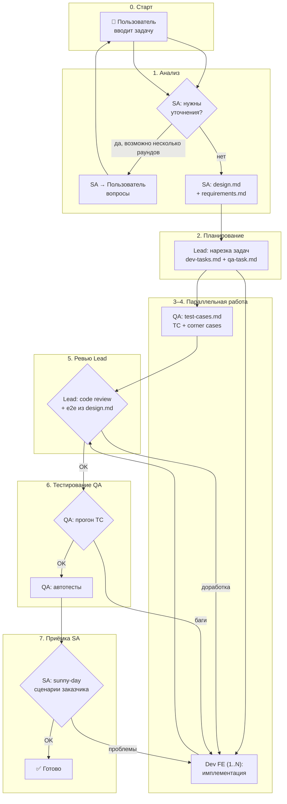
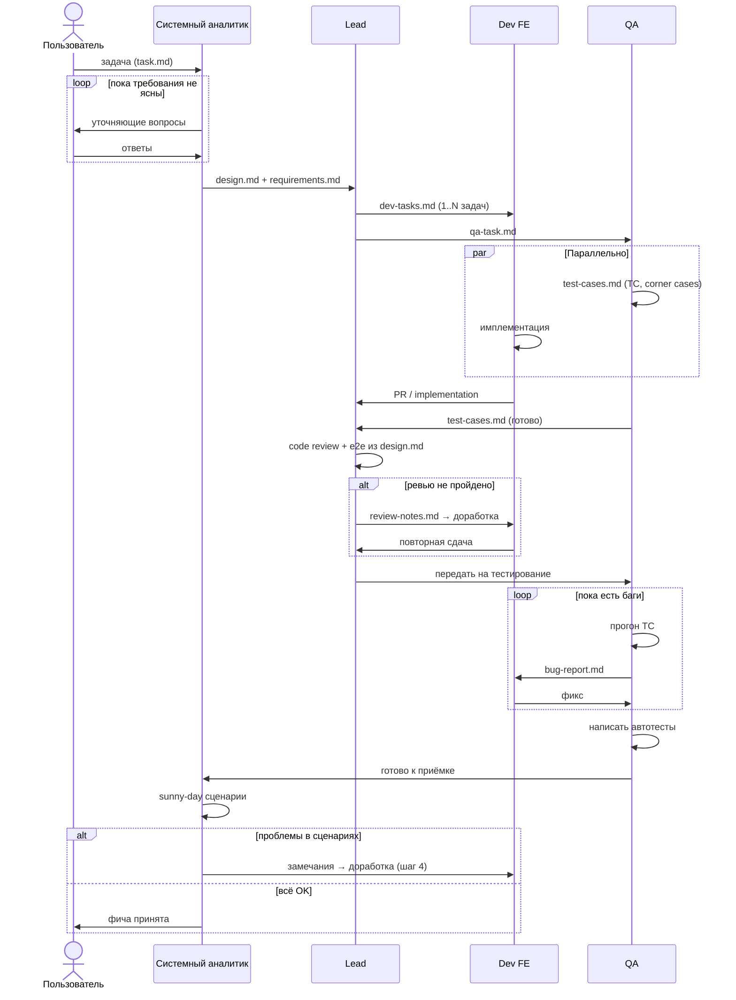
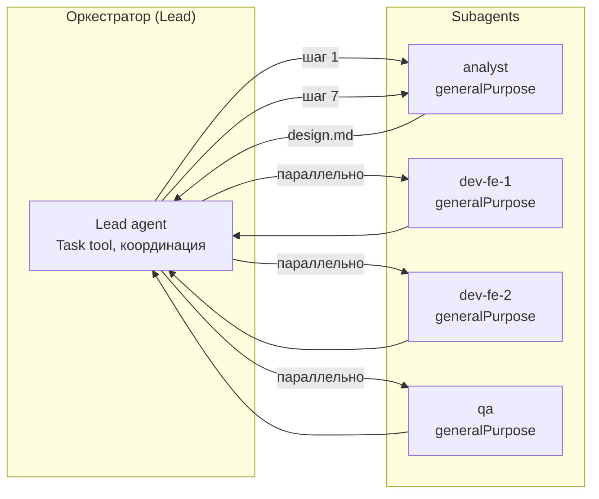

# Multiagents: процесс и команда

Схема оркестрации разработки фичи: от задачи пользователя до приёмки sunny-day сценариев.

## Реализация в Cursor

| Ресурс | Путь |
|--------|------|
| Subagents | `.cursor/agents/` — `/analyst`, `/lead`, `/dev-fe`, `/qa` |
| Оркестрация | skill `multiagents-orchestration` |
| Артефакты | `.cursor/artifacts/` |
| Обзор команд | `.cursor/agents/readme.md` |

## Команда

| Роль | Агент | Ответственность |
|------|-------|-----------------|
| **Пользователь** | Human | Формулирует задачу, отвечает на уточнения |
| **Системный аналитик (SA)** | `analyst` | Уточняет требования, описывает дизайн, финальная приёмка sunny-day |
| **Lead** | `lead` | Декомпозиция, координация, code review, проверка e2e из дизайна |
| **Dev FE** | `dev-fe` (1..N) | Имплементация UI/логики по задачам Lead |
| **QA** | `qa` | Тест-кейсы, ручное тестирование, автотесты |

## Артефакты (что передаётся между ролями)

| Артефакт | Создатель | Потребитель |
|----------|-----------|-------------|
| `task.md` | Пользователь | SA |
| `requirements.md` | SA | Lead, QA, SA (шаг 7) |
| `design.md` | SA | Lead, Dev, QA, SA (шаг 7) |
| `dev-tasks.md` | Lead | Dev FE |
| `qa-task.md` | Lead | QA |
| `test-cases.md` | QA | QA (шаг 6), Dev (справочно) |
| `implementation/` | Dev FE | Lead, QA |
| `review-notes.md` | Lead | Dev FE |
| `bug-report.md` | QA / SA | Dev FE |
| `autotests/` | QA | — (финальный артефакт) |

---

## Процесс (основной поток)

---

## Последовательность (sequence)

---

## Детализация шагов

### 0 → 1. Пользователь → Системный аналитик

**Вход:** свободная формулировка задачи.

**SA делает:**
- Проверяет полноту: цель, границы, ограничения, happy path, исключения.
- Задаёт вопросы пользователю (один или несколько раундов).
- Фиксирует согласованные требования в `requirements.md`.
- Описывает дизайн в `design.md`:
  - UI/UX (экраны, состояния, переходы)
  - поведение (бизнес-правила)
  - e2e-сценарии из дизайна (для Lead на шаге 5)
  - sunny-day сценарии заказчика (для себя на шаге 7)

**Выход:** `requirements.md`, `design.md` → Lead.

---

### 2. Lead — декомпозиция

**Вход:** `design.md`, `requirements.md`.

**Lead делает:**
- Анализирует, можно ли распараллелить FE-работу.
- Нарезает `dev-tasks.md`:
  - одна задача → один Dev FE
  - несколько независимых частей → несколько Dev FE (параллельно)
- Создаёт `qa-task.md`: что покрыть TC, какие corner cases ожидаются.

**Выход:** `dev-tasks.md`, `qa-task.md` → Dev FE + QA (параллельно).

---

### 3–4. Параллель: QA + Dev FE

#### 4а. QA
- Пишет `test-cases.md`: позитивные, негативные, corner cases.
- Не блокирует Dev — TC могут дополняться по мере понимания.

#### 4б. Dev FE
- Имплементирует по `dev-tasks.md` и `design.md`.
- При нескольких Dev — каждый в своей зоне; Lead следит за конфликтами.

**Синхронизация:** оба сдают артефакты Lead на шаг 5.

---

### 5. Lead — ревью

**Lead проверяет:**
- Code review решения Dev.
- Соответствие `design.md`.
- E2e-кейсы, описанные в дизайне (smoke на уровне Lead).

**Решение:**
- ❌ Не OK → `review-notes.md` → Dev (возврат на шаг 4б).
- ✅ OK → передать QA на шаг 6.

---

### 6. QA — тестирование и автотесты

**QA делает:**
- Прогоняет все TC из `test-cases.md`.
- При багах → `bug-report.md` → Dev (возврат на шаг 4б).
- После успешного прогона → пишет автотесты (`autotests/`).

**Выход:** автотесты + подтверждение «готово к приёмке» → SA.

---

### 7. SA — финальная приёмка

**SA делает:**
- Проходит sunny-day сценарии заказчика из `design.md` / `requirements.md`.
- Оценивает с точки зрения пользователя/бизнеса, не только TC.

**Решение:**
- ❌ Проблемы → замечания → Dev (возврат на шаг 4б).
- ✅ OK → фича принята, уведомить пользователя.

---

## Петли доработки (feedback loops)

| Откуда | Куда | Условие | Артефакт |
|--------|------|---------|----------|
| SA (шаг 1) | Пользователь | Неясные требования | Вопросы в чат |
| Lead (шаг 5) | Dev FE (4б) | Ревью не пройдено | `review-notes.md` |
| QA (шаг 6) | Dev FE (4б) | Баги в TC | `bug-report.md` |
| SA (шаг 7) | Dev FE (4б) | Проблемы sunny-day | Замечания аналитика |

Все возвраты на шаг 4б сходятся в Dev; после фикса Dev снова проходит цепочку 5 → 6 → 7.

---

## Оркестрация в Cursor (маппинг ролей)

| Cursor-роль | subagent_type | Когда запускать |
|-------------|---------------|-----------------|
| Lead | родительский агент | Всегда; держит контекст и артефакты |
| SA | `generalPurpose` | Шаги 1 и 7 |
| Dev FE | `generalPurpose` (N экземпляров) | Шаг 4б, доработки |
| QA | `generalPurpose` | Шаги 4а и 6 |

**Правила оркестратора (Lead):**
1. Не запускать Dev и QA на шаг 4, пока нет `design.md`.
2. На шаг 4 запускать QA и Dev **параллельно** (`Task` в одном сообщении).
3. Не передавать в QA на шаг 6, пока ревью (шаг 5) не пройдено.
4. Не вызывать SA на шаг 7, пока QA не подтвердил успешный прогон TC и не написал автотесты.
5. При возврате на 4б — передавать Dev конкретный артефакт (`review-notes.md` / `bug-report.md` / замечания SA).

---

## Чеклист готовности к переходу

| Переход | Критерий |
|---------|----------|
| 1 → 2 | `design.md` и `requirements.md` согласованы, открытых вопросов нет |
| 2 → 4 | `dev-tasks.md` и `qa-task.md` созданы |
| 4 → 5 | Dev сдал код, QA сдал `test-cases.md` |
| 5 → 6 | Lead: ревью OK, e2e из дизайна пройдены |
| 6 → 7 | Все TC зелёные, автотесты написаны |
| 7 → ✅ | Sunny-day сценарии SA пройдены |
