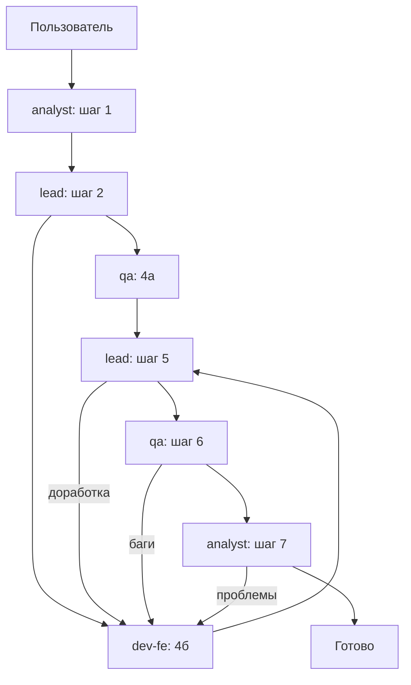

# Multiagents Orchestration

Workflow для **pdf-concatenator-2**. Схема: `.cursor/multiagents.md`. Subagents: `.cursor/agents/`.

## Процесс

```
Пользователь → Analyst (1) → Lead (2) → parallel QA (4а) + Dev (4б)
→ Lead review (5) → QA test (6) → Analyst accept (7) → ✅
```

Петли доработки: Lead (5), QA (6), Analyst (7) → Dev (4б).

## Агенты

| Команда | Файл | Шаги | Readonly |
|---------|------|------|----------|
| `/analyst` | `analyst.md` | 1, 7 | no (артефакты) |
| `/lead` | `lead.md` | 2, 5 | no (артефакты) |
| `/dev-fe` | `dev-fe.md` | 4б, доработки | no |
| `/qa` | `qa.md` | 4а, 6 | no (артефакты) |

Артефакты: `.cursor/artifacts/` (`design.md`, `dev-tasks.md`, `test-cases.md`, …).

## Пошаговый workflow

### 1. Analyst — анализ

```
/analyst
```

- Уточни требования (несколько раундов с пользователем)
- Создай `requirements.md`, `design.md`
- **Gate:** открытых критичных вопросов нет

### 2. Lead — декомпозиция

```
/lead
```

- Создай `dev-tasks.md`, `qa-task.md`
- **Gate:** задачи нарезаны

### 3–4. Параллельно QA + Dev

В **одном сообщении** запусти Task/subagents:

- `/qa` — фаза 4а → `test-cases.md`
- `/dev-fe` — по каждой DEV-N из `dev-tasks.md`

**Gate:** Dev сдал код, QA сдал `test-cases.md`

### 5. Lead — ревью

```
/lead
```

- Code review + e2e из `design.md`
- OK → QA шаг 6; не OK → `review-notes.md` → Dev

### 6. QA — тестирование

```
/qa
```

- Прогон TC; баги → `bug-report.md` → Dev
- OK → автотесты (если разрешён фреймворк) → Analyst

### 7. Analyst — приёмка

```
/analyst
```

- Sunny-day сценарии заказчика
- OK → фича принята; проблемы → Dev

## Когда один agent vs workflow

| Ситуация | Подход |
|----------|--------|
| Мелкая правка в одном файле | Обычный agent |
| Новая фича с дизайном и QA | **Полный workflow** |
| Только анализ | `/analyst` |
| Только ревью после кода | `/lead` |

## Ограничения проекта

- `scope-minimal`, `scope-guard`
- `npm run build` перед сдачей Dev
- Коммиты — только по просьбе пользователя
- Тест-фреймворк — только по просьбе пользователя

## Диаграмма


